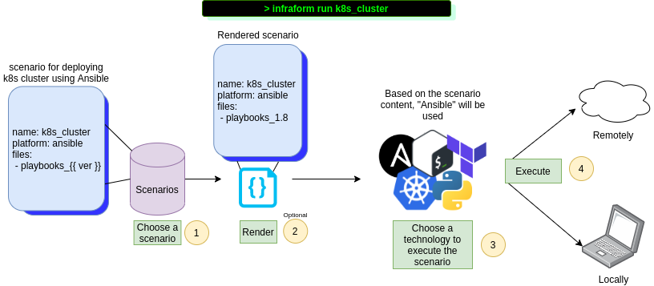

# InfraForm

Unified interface for infrastructure related operations. Infraform allows you to:

* Run common built-in operations (aka scenarios) or provide your own and let infraform handle the execution
* Use templated scenarios - one scenario, many ways to run it
* Execute scenarios locally or on remote hosts
* Use multiple different tools and platforms - Ansible, Python, Terraform, Docker, Docker Compose

Infraform aims to provides users with simple, yet dynamic, way to manage their infra related operations. 
Hope you'll enjoy using it :)

## Requirements

* Linux (Developed and tested on Fedora)
* Python>=3.7

## Installation

    git clone https://github.com/bregman-arie/infraform && cd infraform
    virtualenv ~/ifr_venv && source ~/ifr_venv/bin/activate
    pip install .

## Usage Examples

### Set up ELK on a remote host

    ifr run --scenario elk --host some.host

### Provision OpenStack instance with a floating IP

    infraform run --scenario os-1-vm-fip --vars="network_provider=..."

### SSH to the last host Infraform connected to

    infraform ssh

## Scenarios

Scenario is a predefined instructions file or template. It can be anything - creating a VM, run tests, set up ELK, ... you choose (or write your own) 
Infraform provides you with a couple of built-in scenarios

Name | Platform | Description | Arguments
:------ |:------:|:--------:|:---------:
os-1-vm-fip | Terraform | One OpenStack instance with a floating IP | 
pep8-tests | Podman, Docker | Run PEP8 tests in a container | override_image
elk_filebeat_jenkins | Docker Compose | Containerized ELK + Filbeat + Jenkins and process Jenkins build log

To see the full list of scenarios and learn more it, have a look [here](docs/scenarios.md) or run `infraform list` 
To see the content of scenario, run `infraform show <scenario_name>`

## Supported platforms and tools

InfraForm is able to execute the following types of platforms and tools

Name | Comments 
:------ |:------:
Podman | Run containers using Podman
Docker | Run containers using Docker
docker-compose | Run containers using Docker
Terraform | Provision infrastucture using Terraform HCL files
Python | Run Python programs
Shell | Run Bash shell scripts

## Development

If you are interested in developing Infraform further, please read [here](docs/developer.md)

## Contributions

To contribute to the project use GitHub pull requests.
